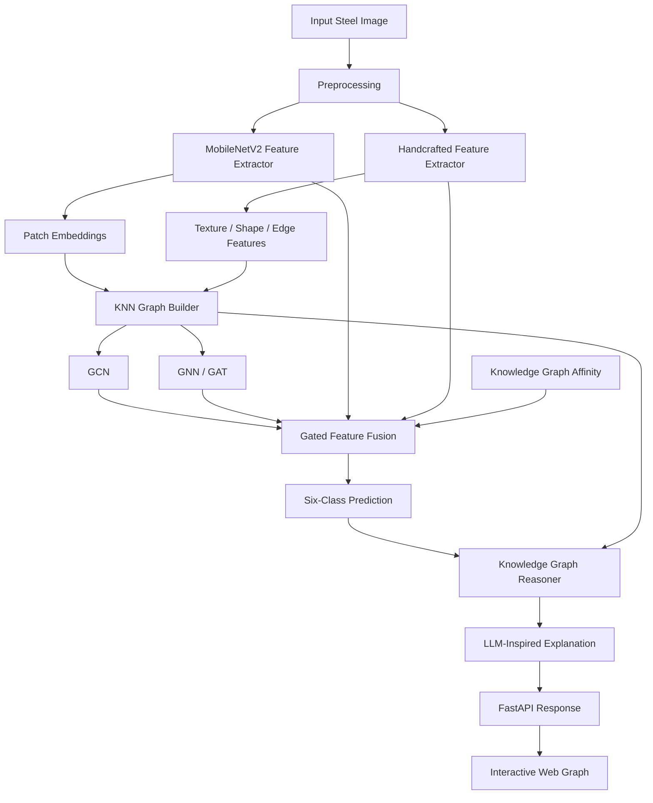
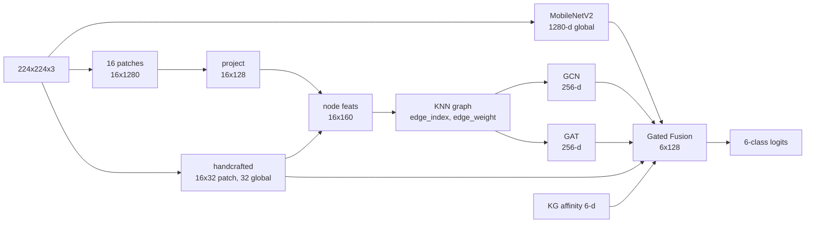
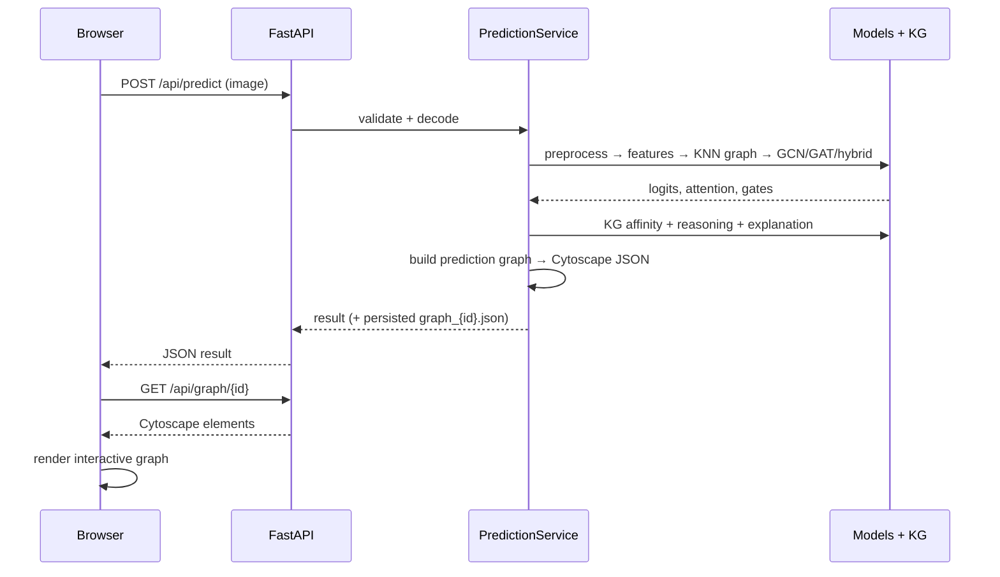
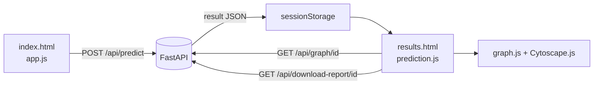
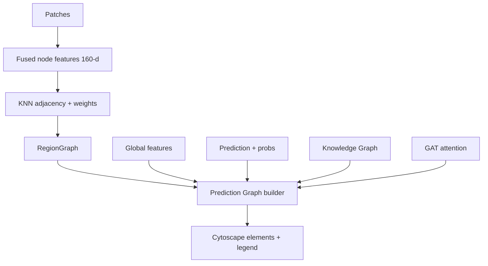

# Architecture — GraphDefect-KG

## 1. Component-level architecture


## 2. Model pipeline (data shapes)


## 3. API flow


## 4. Frontend ↔ backend flow


## 5. Graph creation flow


## 6. Knowledge reasoning flow
```mermaid
flowchart LR
    FEAT[Interpretable features] --> ACT[Property activations]
    ACT --> AFF[Per-class affinity vector]
    PRED[Predicted class] --> PATH[KG reasoning path\ndefect→property→cause]
    ACT --> PATH
    PATH --> EXP[Template explanation\n(optional local LLM)]
    AFF --> EXP
```

## 7. Data schema
### Node schema
| field | type | meaning |
|-------|------|---------|
| id | str | unique node id |
| type | enum(NodeType) | image / patch / region / cnn_feature / texture_feature / shape_feature / edge_feature / defect_evidence / defect_class / prediction / knowledge_concept / cause_concept / explanation |
| label | str | display label |
| shape, color | str | rendering hints |
| importance / activation / probability | float | signal used for sizing |
| supports | bool | supports vs contradicts prediction |
| meta | dict | features, bbox, semantic text, connections |

### Edge schema
| field | type | meaning |
|-------|------|---------|
| id | str | `source__relation__target` |
| source, target | str | node ids |
| relation | enum(EdgeType) | knn_of / visually_similar_to / spatially_adjacent_to / contains / extracted_from / supports / contradicts / associated_with / predicts / belongs_to / has_pattern / has_property / has_texture / has_shape / has_orientation / has_confidence / semantically_related_to |
| weight | float | edge strength |
| color, line_style | str | rendering hints |
| meta | dict | similarity, attention, contribution |

### Result schema (API)
See `backend/api/schemas.py` (`PredictionResponse`): `predicted_class`, `confidence`,
`probabilities`, `prediction_source`, `model_trained`, `untrained_notice`, `reasoning`,
`explanation`, `visual_features`, `kg_affinity`, `component_gates`, `important_regions`,
`model_comparison`, `graph_summary`, `timings_ms`.
