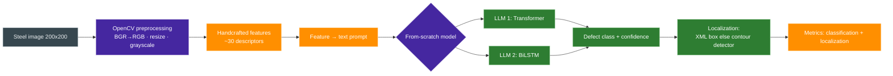

# 🔬 Steel Surface Defect Detection — NEU-DET Research Repository

<div align="center">


**Four independent approaches to the same problem — CNN, from-scratch "tiny LLM", graph neural network, and YOLO — all evaluated on the NEU-DET steel surface defect dataset.**

</div>

---

## 📑 Table of Contents

- [What's in this repository](#-whats-in-this-repository)
- [Repository structure](#-repository-structure)
- [Datasets](#-datasets)
- [Results](#-results)
- [How the metrics are reported (read this)](#-how-the-metrics-are-reported-read-this)
- [Setup](#-setup)
- [Running each track](#-running-each-track)
- [Output artifacts](#-output-artifacts)
- [Limitations & honesty notes](#-limitations--honesty-notes)

---

## 🎯 What's in this repository

This is a **multi-track research repository**, not a single model. Four separate approaches were
built and evaluated against the same six NEU-DET defect classes:

| # | Track | Framework | Location | Core idea |
|---|-------|-----------|----------|-----------|
| 1 | **CNN detectors** | TensorFlow / Keras | root notebooks | AMFF-CNN (SEAM + CEAM attention) and MobileNetV2 + FPN + AMFF, with XML-box localization + mAP evaluation |
| 2 | **From-scratch tiny LLMs** | PyTorch | [`SteelScratchLLM/`](SteelScratchLLM/) | Handcrafted visual descriptors → text prompt → Transformer encoder / BiLSTM classifier trained from random init |
| 3 | **Graph + knowledge-graph** | PyTorch + FastAPI | [`GraphDefect-KG/`](GraphDefect-KG/) | Image → region graph → GCN/GAT → knowledge-graph reasoning → explainable web app |
| 4 | **YOLO comparison** | Ultralytics | [`yolo_detection.ipynb`](yolo_detection.ipynb) | YOLOv8n baseline compared against AMFF-CNN / Base-CNN |

The six target classes throughout:

```text
crazing   inclusion   patches   pitted_surface   rolled-in_scale   scratches
```

> **No external LLM APIs are used anywhere in this repository.** The "LLM" models in track 2 are
> small, domain-specific neural classifiers trained from scratch on structured visual descriptors —
> not GPT-class models. (One legacy notebook, [`LLM_STEEL_.ipynb`](LLM_STEEL_.ipynb), is an earlier
> Claude/Groq API experiment kept for history and is *not* part of the current results.)

---

## 📂 Repository structure

```text
Steel_Surface_Defect_NEU_DET-DATASET/
│
├── NEU_DATASET.ipynb              # Track 1 — AMFF-CNN (SEAM + CEAM), classification
├── object_detection.ipynb         # Track 1 — AMFF-CNN + XML-box localization, IoU/mAP
├── new_model_code.ipynb           # Track 1 — MobileNetV2 + FPN + AMFF (best CNN result)
├── yolo_detection.ipynb           # Track 4 — YOLOv8n vs AMFF-CNN vs Base-CNN
├── LLM_STEEL_.ipynb               # legacy — Claude/Groq API experiment (superseded)
├── LLM_COMPONENTS.md              # component-level write-up of the from-scratch Transformer
├── yolov8n.pt                     # YOLOv8 nano weights
│
├── NEU-DET/                       # primary dataset (1800 images + 1800 VOC XML)
│   ├── IMAGES/<class>/*.jpg
│   ├── ANNOTATIONS/*.xml
│   └── OUTPUT_SCRATCH_LLM/        # track 2 results, weights, charts
│
├── SteelScratchLLM/               # Track 2 — two from-scratch models
│   ├── LLM_STEEL_SCRATCH_LOCAL.ipynb              # main notebook (LLM 1 + LLM 2 on NEU-DET)
│   ├── SteeldefctX_LLM_STEEL_SCRACTCH_LOCAL.ipynb # same pipeline on the SteelDefectX dataset
│   ├── LLM2_BiLSTM_DETAILS.md                     # BiLSTM design write-up
│   ├── README.md                                  # track-level docs
│   ├── src/                       # CLI version (Transformer only)
│   │   ├── config.py  features.py  model.py
│   │   └── train.py   predict.py   evaluate.py
│   ├── models/                    # tokenizer vocab, labels, checkpoint
│   ├── run_train.bat  run_predict.bat  run_evaluate.bat
│   └── requirements.txt
│
├── SteelDefectX/                  # secondary dataset + its BiLSTM run
│   ├── train_by_class/<class>/    # 4,871 images across 24 defect classes
│   ├── train-text.json            # per-image NL descriptions + structured attributes
│   ├── class_descriptions.json
│   └── OUTPUT_BILSTM/             # metrics, confusion matrix, batch figures, seg detector
│
├── GraphDefect-KG/                # Track 3 — full FastAPI web application
│   ├── backend/                   # api/ graph/ models/ reasoning/ services/ utils/
│   ├── frontend/                  # index.html, results.html, css/, js/ (vendored cytoscape)
│   ├── notebooks/model_code.ipynb # 33-section reproducible training notebook
│   ├── research/                  # proposal, methodology, novelty, experiment & ablation plans
│   ├── tests/                     # pytest suite (dataset-free)
│   └── run.py                     # server entry point
│
└── OUTPUTS_ALL/                   # archived figures & metrics from track 1 & 4 runs
    ├── Model_Outputs_1/           # MobileNetV2+FPN+AMFF — metrics JSON, model report, .h5
    ├── Outputs/                   # AMFF-CNN detection batches + per-image comparisons
    ├── OUTPUTS_AMFF/ OUTPUTS_BASE_CNN/ YOLO_OUTPUT/ new_Outputs/
    └── *.png                      # headline figures
```

---

## 📊 Datasets

### NEU-DET (primary)

Perfectly balanced, 200×200 grayscale-ish steel surface images with PASCAL-VOC bounding boxes.

| Class | Images | Annotations |
|-------|--------|-------------|
| crazing | 300 | ✅ |
| inclusion | 300 | ✅ |
| patches | 300 | ✅ |
| pitted_surface | 300 | ✅ |
| rolled-in_scale | 300 | ✅ |
| scratches | 300 | ✅ |
| **Total** | **1,800** | **1,800 XML** |

### SteelDefectX (secondary)

A larger, 24-class dataset (4,871 images in [`SteelDefectX/train_by_class/`](SteelDefectX/train_by_class/),
CC-BY-4.0) shipped with natural-language descriptions and structured attributes per image
([`train-text.json`](SteelDefectX/train-text.json)). The BiLSTM run uses the **six classes that
overlap with NEU-DET** — 1,631 images — so results stay comparable.

---

## 📈 Results

> Every number below is read directly from a results file committed in this repo. The file path is
> given so any figure can be traced back to the run that produced it.

### Track 1 — MobileNetV2 + FPN + AMFF (best CNN)

Source: [`OUTPUTS_ALL/Model_Outputs_1/evaluation_metrics.json`](OUTPUTS_ALL/Model_Outputs_1/evaluation_metrics.json)

| Metric | Value |
|--------|-------|
| Accuracy | **98.33 %** |
| Precision (macro) | 98.44 % |
| Recall (macro) | 98.33 % |
| F1 (macro) | 98.33 % |
| mAP @[.5:.95] | 85.17 % |
| AP@50 | 97.34 % |
| AP@75 | 73.00 % |

<details>
<summary>Per-class precision / recall / F1</summary>

| Class | Precision | Recall | F1 |
|-------|-----------|--------|-----|
| crazing | 1.000 | 0.983 | 0.992 |
| inclusion | 0.923 | 1.000 | 0.960 |
| patches | 1.000 | 1.000 | 1.000 |
| pitted_surface | 1.000 | 1.000 | 1.000 |
| rolled-in_scale | 0.984 | 1.000 | 0.992 |
| scratches | 1.000 | 0.917 | 0.957 |

</details>

Model size — from [`MODEL_REPORT.txt`](OUTPUTS_ALL/Model_Outputs_1/MODEL_REPORT.txt):
**13,537,007 total params** (11,275,951 trainable, 2,261,056 frozen MobileNetV2 backbone),
input 128×128×3, FPN levels P2–P5 at 512 channels.

> The earlier **AMFF-CNN vs Base-CNN** comparison (`NEU_DATASET.ipynb`, `object_detection.ipynb`)
> produced figures only — see [`OUTPUTS_ALL/Outputs/`](OUTPUTS_ALL/Outputs/),
> [`OUTPUTS_ALL/OUTPUTS_AMFF/`](OUTPUTS_ALL/OUTPUTS_AMFF/) and
> [`OUTPUTS_ALL/OUTPUTS_BASE_CNN/`](OUTPUTS_ALL/OUTPUTS_BASE_CNN/). No metrics JSON was saved for
> that run, so no numeric table is claimed here. Re-run the notebooks to regenerate one.

### Track 2 — From-scratch tiny LLMs on NEU-DET (all 1,800 images)

Sources: [`scratch_llm_results_all1800.json`](NEU-DET/OUTPUT_SCRATCH_LLM/scratch_llm_results_all1800.json),
[`scratch_llm2_results_all1800.json`](NEU-DET/OUTPUT_SCRATCH_LLM/scratch_llm2_results_all1800.json),
[`final_summary.json`](NEU-DET/OUTPUT_SCRATCH_LLM/final_summary.json)

| | **LLM 1** — `TinySteelLLM_FromScratch` | **LLM 2** — `SteelSense-BiLSTM` |
|---|---|---|
| Architecture | Transformer encoder (self-attention) | 2-layer BiLSTM + multi-view attention pooling |
| Config | embed 96, 2 layers, 4 heads, 18 epochs, lr 3e-4 | embed 96, hidden 192×2, dropout 0.30, 30 epochs, lr 8e-4 (OneCycle) |
| Prompt | coarse (~18 tokens, 4-level bins) | rich (~40 tokens, 7-level bins + GLCM + per-quadrant) |
| Extras | — | label smoothing 0.06, +2 jittered copies, top-5 snapshot ensemble |
| **Accuracy** | **93.50 %** (1683 / 1800) | **99.89 %** (1798 / 1800) |
| Runtime | 628.9 s | 1605.4 s |
| [A] classification-quality mAP | 86.13 % | 92.54 % |
| [B] contour-localization AP50 | 10.35 % | 11.24 % |
| [B] contour-localization mAP | 4.20 % | 4.55 % |

<details>
<summary>Per-class accuracy</summary>

| Class | LLM 1 (Transformer) | LLM 2 (BiLSTM) |
|-------|--------------------:|---------------:|
| crazing | 98.33 % | 100.00 % |
| inclusion | 93.67 % | 99.67 % |
| patches | 89.33 % | 100.00 % |
| pitted_surface | 96.00 % | 100.00 % |
| rolled-in_scale | 100.00 % | 100.00 % |
| scratches | 83.67 % | 99.67 % |

</details>

### Track 2b — SteelSense-BiLSTM on SteelDefectX (1,631 images, 6 overlapping classes)

Sources: [`steeldefectx_bilstm_runall.json`](SteelDefectX/OUTPUT_BILSTM/steeldefectx_bilstm_runall.json),
[`steeldefectx_detector_metrics.json`](SteelDefectX/OUTPUT_BILSTM/steeldefectx_detector_metrics.json)

| Metric | Value |
|--------|-------|
| Classification accuracy | **99.45 %** (1622 / 1631) |
| Detector mAP @[.5:.95] | 68.22 % |
| Detector AP50 | 82.10 % |
| Detector AP75 | 70.57 % |
| Mean IoU | 0.772 |

Localization here comes from a **learned segmentation FCN** (`seg_detector2.pt`, evaluated at
128 px) rather than the classical contour detector used on NEU-DET — which is why its AP is an
order of magnitude higher than track 2's contour numbers. AP decreases monotonically as the IoU
threshold rises (82.10 → 70.57 → 39.85 at IoU 0.95), the expected ordering for a real detector.

### Track 3 — GraphDefect-KG

**Ships untrained by design.** The deep hybrid graph model has no committed checkpoint; out of the
box the authoritative class comes from a genuinely fitted MobileNetV2 + KNN baseline, and every
untrained output is flagged (`model_trained`, `prediction_source`, `untrained_notice`). No metrics
are claimed until you run [`GraphDefect-KG/notebooks/model_code.ipynb`](GraphDefect-KG/notebooks/model_code.ipynb).
See [`GraphDefect-KG/README.md`](GraphDefect-KG/README.md).

---

## ⚖️ How the metrics are reported (read this)

The from-scratch LLM notebooks deliberately report **two separate, clearly-labelled scores**,
because they measure very different things and must never be conflated:

| | **[A] Classification-quality score** | **[B] Localization score** |
|---|---|---|
| Regions used | XML ground-truth boxes **relabelled** with the predicted class | boxes from the class-aware **contour detector** (no ground-truth leakage) |
| IoU | ≡ 1.0 by construction → threshold-invariant | genuine IoU against XML boxes |
| What it actually measures | classification accuracy | real detection quality |
| Typical value | 86–93 % | ~10 % AP50 |

Classical contour localization on NEU-DET genuinely lands in the **low tens of percent AP50** — the
90 %+ figures in the [A] column are a classification score wearing a detection-metric name, and are
labelled as such everywhere. This is why track 2b's learned segmentation detector (82.10 % AP50) is
reported separately from track 2's contour detector (10.35 % AP50).

---

## 🔧 Setup

Requires **Python 3.10+**. Each track has its own dependency set — install only what you need.

<details>
<summary><b>Track 1 & 4 — TensorFlow notebooks</b></summary>

```bash
python -m venv .venv
.venv\Scripts\activate          # Windows
# source .venv/bin/activate     # Linux/macOS

pip install tensorflow numpy matplotlib seaborn scikit-learn opencv-python Pillow
pip install ultralytics          # track 4 only (YOLOv8)
```

</details>

<details>
<summary><b>Track 2 — SteelScratchLLM (PyTorch)</b></summary>

```bash
cd SteelScratchLLM
python -m venv venv
venv\Scripts\activate
pip install -r requirements.txt   # torch, opencv, scikit-image, scikit-learn, matplotlib, ...
```

</details>

<details>
<summary><b>Track 3 — GraphDefect-KG (PyTorch + FastAPI)</b></summary>

```bash
cd GraphDefect-KG
python -m venv .venv
.venv\Scripts\activate

# 1) PyTorch for your platform (CPU example):
pip install torch torchvision --index-url https://download.pytorch.org/whl/cpu
# 2) everything else:
pip install -r backend/requirements.txt
```

`torch-geometric` is optional — the graph models fall back to a built-in native message-passing
implementation.

</details>

---

## 🚀 Running each track

### Track 1 — CNN detectors

```bash
jupyter notebook new_model_code.ipynb     # MobileNetV2 + FPN + AMFF  (best CNN result)
jupyter notebook object_detection.ipynb   # AMFF-CNN + XML localization + IoU/mAP
jupyter notebook NEU_DATASET.ipynb        # AMFF-CNN vs Base-CNN classification
```

All three read `NEU-DET/IMAGES/<class>/` and `NEU-DET/ANNOTATIONS/`, and write figures + metrics
into an output directory alongside the notebook.

### Track 2 — From-scratch tiny LLMs

**Notebook (recommended):** open [`SteelScratchLLM/LLM_STEEL_SCRATCH_LOCAL.ipynb`](SteelScratchLLM/LLM_STEEL_SCRATCH_LOCAL.ipynb)
and *Run All*:

1. **Cells 1–4** — setup, config, `extract_rich_features`, LLM 1 prompt builder
2. **Cell 5 / 5B** — define LLM 1 (Transformer) and LLM 2 (BiLSTM)
3. **Cell 6** — localization (XML boxes, else class-aware contour detector)
4. **Cell 7 / 7B** — train or load; set `force_retrain=False` after the first run
5. **Cell 9 / 11B** — run all 1,800 images → `predictions` / `predictions_llm2`
6. **Cells 10–13** — detection visualizations and area/accuracy charts
7. **Cell 16 / 16B** — detection metrics (mAP / AP50 / AP75) per model
8. **Cell 17** — side-by-side comparison → `both_llms_comparison.png/.json`

For the SteelDefectX variant use [`SteeldefctX_LLM_STEEL_SCRACTCH_LOCAL.ipynb`](SteelScratchLLM/SteeldefctX_LLM_STEEL_SCRACTCH_LOCAL.ipynb).

**CLI (Transformer only):**

```bash
cd SteelScratchLLM
python src\train.py    --dataset NEU-DET --epochs 35
python src\predict.py  --image sample_data\test.jpg --dataset NEU-DET --save results\prediction.jpg
python src\evaluate.py --dataset NEU-DET --draw
```

(or double-click `run_train.bat` / `run_predict.bat` / `run_evaluate.bat`)

<details>
<summary>Shared pipeline</summary>


```mermaid
flowchart LR
    A[Steel image 200x200] --> B[OpenCV preprocessing<br/>BGR→RGB · resize · grayscale]
    B --> C[Handcrafted features<br/>~30 descriptors]
    C --> D[Feature → text prompt]
    D --> E{From-scratch model}
    E --> F[LLM 1: Transformer]
    E --> G[LLM 2: BiLSTM]
    F --> H[Defect class + confidence]
    G --> H
    H --> I[Localization:<br/>XML box else contour detector]
    I --> J[Metrics: classification + localization]

style A fill:#37474f,stroke:#cfd8dc,color:#eceff1
style B fill:#4527a0,stroke:#d1c4e9,color:#ffffff
style C fill:#ff8f00,stroke:#ffe0b2,color:#ffffff
style D fill:#ff8f00,stroke:#ffe0b2,color:#ffffff
style E fill:#4527a0,stroke:#d1c4e9,color:#ffffff
style F fill:#2e7d32,stroke:#a5d6a7,color:#ffffff
style G fill:#2e7d32,stroke:#a5d6a7,color:#ffffff
style H fill:#2e7d32,stroke:#a5d6a7,color:#ffffff
style I fill:#2e7d32,stroke:#a5d6a7,color:#ffffff
style J fill:#ff8f00,stroke:#ffe0b2,color:#ffffff
```

**Handcrafted features** (`extract_rich_features`): intensity stats + entropy, Canny/Sobel/
Laplacian edges, morphological region stats, 4-quadrant stats, FFT centre energy, and GLCM texture
(contrast / homogeneity / energy / correlation). No median filter, no normalization, no LBP —
only these operations. (Contour localization separately applies CLAHE + blur.)

Full component-level breakdown: [`LLM_COMPONENTS.md`](LLM_COMPONENTS.md) ·
[`SteelScratchLLM/LLM2_BiLSTM_DETAILS.md`](SteelScratchLLM/LLM2_BiLSTM_DETAILS.md)

</details>

### Track 3 — GraphDefect-KG web app

```bash
cd GraphDefect-KG
python run.py                      # http://127.0.0.1:8000
python run.py --port 8080 --reload
pytest tests -q                    # dataset-free test suite
```

Drop a steel image on the landing page → **Analyse defect** → the results page shows the
prediction, probabilities, evidence, knowledge-graph reasoning path, model comparison, and an
interactive Cytoscape prediction graph. Interactive API docs at `/docs`.

To train real models: `jupyter notebook notebooks/model_code.ipynb` (33 sections, runs
top-to-bottom), then save a `HybridDefectModel` `state_dict` under key `"model"` to
`backend/saved_models/hybrid_model.pt` — the loader picks it up and switches `prediction_source`
to `hybrid`.

### Track 4 — YOLOv8 comparison

```bash
pip install ultralytics
jupyter notebook yolo_detection.ipynb
```

Uses the bundled `yolov8n.pt` weights and compares YOLOv8n against AMFF-CNN and Base-CNN on the
same NEU-DET images. Figures land in [`OUTPUTS_ALL/YOLO_OUTPUT/`](OUTPUTS_ALL/YOLO_OUTPUT/) and
[`OUTPUTS_ALL/new_Outputs/`](OUTPUTS_ALL/new_Outputs/).

---

## 🗂️ Output artifacts

| Location | Contents |
|----------|----------|
| [`OUTPUTS_ALL/Model_Outputs_1/`](OUTPUTS_ALL/Model_Outputs_1/) | MobileNetV2+FPN+AMFF — `evaluation_metrics.json`, `MODEL_REPORT.txt`, `FULL_MODEL_SUMMARY.txt`, `.h5` model, 15 detection batches, training history |
| [`OUTPUTS_ALL/Outputs/`](OUTPUTS_ALL/Outputs/) | AMFF-CNN detection batches, area analysis, `amff_cnn_final_model.h5`, ~900 per-image comparison figures |
| [`OUTPUTS_ALL/OUTPUTS_AMFF/`](OUTPUTS_ALL/OUTPUTS_AMFF/) · [`OUTPUTS_BASE_CNN/`](OUTPUTS_ALL/OUTPUTS_BASE_CNN/) | side-by-side batch outputs for the two CNNs |
| [`OUTPUTS_ALL/YOLO_OUTPUT/`](OUTPUTS_ALL/YOLO_OUTPUT/) · [`new_Outputs/`](OUTPUTS_ALL/new_Outputs/) | YOLO-style detection batches and metric plots |
| [`NEU-DET/OUTPUT_SCRATCH_LLM/`](NEU-DET/OUTPUT_SCRATCH_LLM/) | track 2 — both models' result JSONs, `final_summary.json`, `both_llms_comparison.png/.json`, trained `.pt` weights, tokenizers, batch/area charts |
| [`SteelDefectX/OUTPUT_BILSTM/`](SteelDefectX/OUTPUT_BILSTM/) | track 2b — metrics JSONs, classification report, confusion matrix, 16 batch figures, `steeldefectx_bilstm.pt`, `seg_detector*.pt` |

Large binaries (`*.h5`, `*.pt`, `*.pkl`, `*.joblib`) and the `Outputs/`-family folders are
**gitignored** — regenerate them by running the notebooks.

---

## ⚠️ Limitations & honesty notes

- **No fabricated metrics.** Every number in this README traces to a committed JSON. Where a run
  produced only figures (AMFF-CNN vs Base-CNN), no numeric claim is made.
- **These are not GPT-class LLMs.** Track 2's models are lightweight, domain-specific classifiers
  trained from scratch on structured visual descriptors — no pretrained weights, no external API.
  Suggested phrasing for papers: *"Two lightweight from-scratch models — an LLM-inspired Transformer
  encoder and a BiLSTM classifier with multi-view attention pooling — were trained on structured
  visual descriptors extracted from steel surface images."*
- **Classification ≫ localization.** The near-perfect accuracies are classification results. Honest
  IoU-based localization is far weaker with contour detection (~10 % AP50) and moderate with the
  learned segmentation detector (82.10 % AP50).
- **GraphDefect-KG is a research prototype.** Its deep hybrid model ships untrained; the
  knowledge-graph affinity is a rule-based domain prior and explanation aid, not a learned
  classifier. All novelty claims in `GraphDefect-KG/research/` are marked *proposed*, pending
  literature review and controlled experiments.
- **Predictions are model outputs, not certified inspection results.**

---

<div align="center">

**Six defect classes · four approaches · 1,800 + 4,871 images · all metrics traceable to source**

</div>
