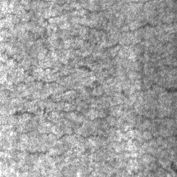
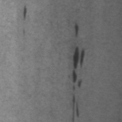
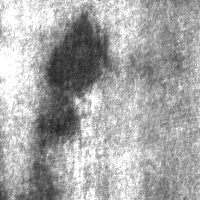
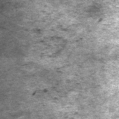
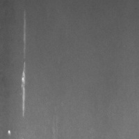
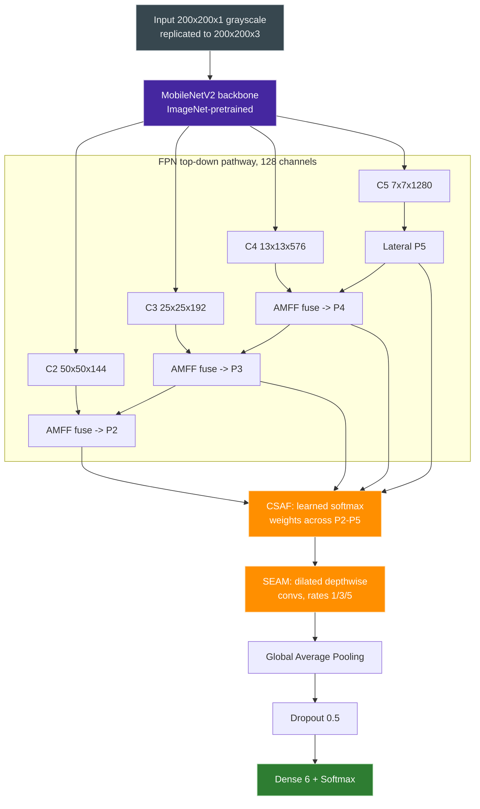

# 🔬 AMFF-CNN Steel Surface Defect Detection

<div align="center">


### 🚀 Lightweight MobileNetV2–FPN Framework for Steel Surface Defect Classification

*Six-class classification with Grad-CAM-based post-hoc weak localization — real, measured results, no invented numbers*

</div>

---

## 📑 Table of Contents

<details>
<summary>🔍 Click to expand</summary>

- [🎯 Project Overview](#-project-overview)
- [✨ Key Features](#-key-features)
- [🏗️ Architecture](#️-architecture)
- [🔧 Installation](#-installation)
- [🚀 Quick Start](#-quick-start)
- [📊 Dataset](#-dataset)
- [🧠 Model Architecture](#-model-architecture)
- [📈 Results](#-results)
- [🤖 From-Scratch Tiny LLMs (Alternative Approach)](#-from-scratch-tiny-llms-alternative-approach)
- [🔬 SteelSense-BiLSTM + SteelDefectX (Second Alternative Approach)](#-steelsense-bilstm--steeldefectx-second-alternative-approach)
- [🎮 Usage Examples](#-usage-examples)
- [📚 API Reference](#-api-reference)
- [🤝 Contributing](#-contributing)
- [📄 License](#-license)

</details>

---

## 🎯 Project Overview

<div align="center">

This project implements a **lightweight MobileNetV2–FPN framework (AMFF-CNN)** for six-class steel surface-defect **classification**, with **Grad-CAM-based post-hoc weak localization** (no bounding-box supervision, no detection head). The network is trained exclusively with image-level categorical cross-entropy. Its multi-scale fusion pathway combines three modules:

- 🧩 **AMFF (Attention-Modulated Multi-Feature Fusion)**: parallel channel + spatial attention applied at each FPN lateral-fusion point
- 🔀 **CSAF (Cross-Scale Adaptive Fusion)**: learns per-sample, softmax-normalized contribution weights across the P2–P5 pyramid levels
- 🔍 **SEAM (Spatial Enhancement Attention Module)**: parallel dilated depthwise convolutions (rates 1, 3, 5) for spatial context enhancement

> Naming note: earlier drafts of this project used **CEAM**; it has been retired in favor of **CSAF** everywhere in the code and this README.

### 🎪 Sample Defect Images (real NEU-DET samples)

<details>
<summary>🖼️ Click to see sample defect images</summary>

| Defect Type               | Sample                                                         | Description                                               |
| ------------------------- | -------------------------------------------------------------- | --------------------------------------------------------- |
| **Crazing**         |                | Fine crack-like structures from thermal/mechanical stress |
| **Inclusion**       |          | Non-metallic particles embedded in the surface            |
| **Patches**         |                | Irregular regions with distinct surface texture           |
| **Pitted Surface**  |   | Localized depressions / corrosion-like spots              |
| **Rolled-in Scale** |  | Oxide material pressed in during hot rolling              |
| **Scratches**       |          | Linear marks from rollers, tools, or handling             |

</details>

</div>

---

## ✨ Key Features

<div align="center">

| 🌟 Feature | 📝 Description | 💪 Benefit |
|------------|----------------|------------|
| **Native-resolution input** | 200×200×1 grayscale, replicated to 3ch — no resizing to 128/224 | No loss of fine defect detail |
| **Multi-scale FPN** | MobileNetV2 taps C2–C5 → 128-channel pyramid P2–P5 | Represents both fine (scratch/crazing) and broad (patch) defects |
| **AMFF** | Parallel channel + spatial attention at each FPN lateral fusion | Re-weights discriminative channels/regions before fusion |
| **CSAF** | Learned, softmax-normalized cross-scale fusion weights (per sample) | Explicit, input-adaptive scale selection — the paper's core contribution |
| **SEAM** | Parallel dilated depthwise convs (rates 1, 3, 5) + sigmoid gate | Broadens receptive field without extra stride |
| **Real, executed ablation** | Module-ladder (baseline→+FPN→+AMFF→+CSAF→+SEAM), 3 seeds | Measured — not asserted — module contributions ([see Results](#-results)) |
| **CAM-based weak localization** | Grad-CAM → threshold → morphology → boxes, evaluated post-hoc | Honestly reported as weak localization, not object detection |

</div>

---

## 🏗️ Architecture

### 🧠 AMFF-CNN Architecture Flow (as implemented in `new_model_code.ipynb`)


```mermaid
flowchart TB
    A[Input 200x200x1 grayscale<br/>replicated to 200x200x3] --> B[MobileNetV2 backbone<br/>ImageNet-pretrained]
    B --> C2[C2 50x50x144]
    B --> C3[C3 25x25x192]
    B --> C4[C4 13x13x576]
    B --> C5[C5 7x7x1280]

    subgraph FPN["FPN top-down pathway, 128 channels"]
        C2 --> P2fuse[AMFF fuse -> P2]
        C3 --> P3fuse[AMFF fuse -> P3]
        C4 --> P4fuse[AMFF fuse -> P4]
        C5 --> P5[Lateral P5]
        P5 --> P4fuse --> P3fuse --> P2fuse
    end

    P2fuse --> CSAF[CSAF: learned softmax<br/>weights across P2-P5]
    P3fuse --> CSAF
    P4fuse --> CSAF
    P5 --> CSAF

    CSAF --> SEAM[SEAM: dilated depthwise<br/>convs, rates 1/3/5]
    SEAM --> GAP[Global Average Pooling]
    GAP --> DROP[Dropout 0.5]
    DROP --> OUT[Dense 6 + Softmax]

style A fill:#37474f,stroke:#cfd8dc,color:#eceff1
style B fill:#4527a0,stroke:#d1c4e9,color:#ffffff
style CSAF fill:#ff8f00,stroke:#ffe0b2,color:#ffffff
style SEAM fill:#ff8f00,stroke:#ffe0b2,color:#ffffff
style OUT fill:#2e7d32,stroke:#a5d6a7,color:#ffffff
```

📎 The exact rendered diagram used in the paper: [`paper_results/figures/figure2_architecture.png`](paper_results/figures/figure2_architecture.png)

### 🔍 SEAM Module (real implementation)

<details>
<summary>Click to expand SEAM architecture</summary>

```python
class SEAM(layers.Layer):
    """Spatial Enhancement Attention Module — parallel dilated depthwise convs,
    concatenated, collapsed to a sigmoid spatial gate, applied residually."""

    def __init__(self, dilation_rates=(1, 3, 5), **kw):
        super().__init__(**kw)
        self.dilation_rates = tuple(dilation_rates)

    def build(self, input_shape):
        self.branches = [layers.DepthwiseConv2D(3, padding="same", dilation_rate=r,
                                                 use_bias=False) for r in self.dilation_rates]
        self.bns = [layers.BatchNormalization() for _ in self.dilation_rates]
        self.attn = layers.Conv2D(1, 1, padding="same", activation="sigmoid")

    def call(self, x, training=None):
        feats = [tf.nn.relu(bn(br(x), training=training))
                 for br, bn in zip(self.branches, self.bns)]
        a = self.attn(tf.concat(feats, axis=-1))
        return x * (1.0 + a)          # residual gating
```

</details>

---

## 🔧 Installation

### 📋 Prerequisites

<details>
<summary>🐍 Python Environment Setup</summary>

```bash
# Create virtual environment
python -m venv steel_defect_env
source steel_defect_env/bin/activate  # Linux/Mac
# or
steel_defect_env\Scripts\activate     # Windows
```

</details>

### 📦 Dependencies

```bash
# Install required packages
pip install -r requirements.txt
```

<details>
<summary>📄 requirements.txt</summary>

```txt
tensorflow>=2.8.0
numpy>=1.21.0
matplotlib>=3.5.0
seaborn>=0.11.0
scikit-learn>=1.1.0
opencv-python>=4.5.0
Pillow>=8.3.0
```

</details>

### ⚡ Quick Installation

```bash
# Clone repository
git clone https://github.com/yourusername/amff-cnn-steel-defect.git
cd amff-cnn-steel-defect

# Install dependencies
pip install -r requirements.txt

# Download dataset (if available)
python download_dataset.py
```

---

## 🚀 Quick Start

### 🎮 Basic Usage

```python
# Import the model
from amff_cnn import build_amff_cnn, build_base_cnn
from data_loader import load_data

# Load and prepare data
train_gen, val_gen = load_data('path/to/dataset')

# Build and train AMFF-CNN
amff_model = build_amff_cnn(input_shape=(128, 128, 3), num_classes=6)
history = amff_model.fit(train_gen, validation_data=val_gen, epochs=50)

# Compare with base CNN
base_model = build_base_cnn(input_shape=(128, 128, 3), num_classes=6)
base_history = base_model.fit(train_gen, validation_data=val_gen, epochs=50)
```

### 🎯 Single Image Prediction

```python
import numpy as np
from tensorflow.keras.preprocessing import image

def predict_defect(model, img_path):
    img = image.load_img(img_path, target_size=(128, 128))
    img_array = image.img_to_array(img) / 255.0
    img_array = np.expand_dims(img_array, axis=0)
  
    predictions = model.predict(img_array)
    class_names = ['crazing', 'inclusion', 'patches', 
                   'pitted_surface', 'rolled-in_scale', 'scratches']
  
    predicted_class = class_names[np.argmax(predictions)]
    confidence = np.max(predictions) * 100
  
    return predicted_class, confidence

# Usage
defect_type, confidence = predict_defect(amff_model, 'path/to/image.jpg')
print(f"Predicted: {defect_type} (Confidence: {confidence:.2f}%)")
```

---

## 📊 Dataset

### 📁 Dataset Structure

```
Steel_Surface_Defect/
├── images/
│   ├── crazing/
│   │   ├── img_001.jpg
│   │   └── ...
│   ├── inclusion/
│   │   ├── img_001.jpg
│   │   └── ...
│   ├── patches/
│   ├── pitted_surface/
│   ├── rolled-in_scale/
│   └── scratches/
└── README.md
```

### 📈 Dataset Statistics — fixed, leakage-free 70/10/20 split

<div align="center">

| Split | Total | Crazing | Inclusion | Patches | Pitted Surface | Rolled-in Scale | Scratches |
|-------|-------|---------|-----------|---------|-----------------|------------------|-----------|
| Train | 1260 | 210 | 210 | 210 | 210 | 210 | 210 |
| Validation | 180 | 30 | 30 | 30 | 30 | 30 | 30 |
| Test | 360 | 60 | 60 | 60 | 60 | 60 | 60 |
| **Total** | **1800** | **300** | **300** | **300** | **300** | **300** | **300** |

No image appears in more than one split (verified — see `verify_coverage()` / split-leakage assertions in `new_model_code.ipynb`). Native resolution **200×200**, single-channel grayscale, replicated to 3 channels for the ImageNet-pretrained MobileNetV2 stem — no resizing to 128×128 or 224×224 anywhere in training or evaluation.

</div>

---

## 🧠 Model Architecture

### 🎯 AMFF-CNN Components

<details>
<summary>🧩 AMFF (Attention-Modulated Multi-Feature Fusion)</summary>

Applied at each FPN lateral-fusion point, in **parallel** (not sequential like CBAM):

- **Channel branch**: GAP → bottleneck MLP → sigmoid gate
- **Spatial branch**: 7×7 conv over concatenated avg/max channel descriptors
- Channel-refined, spatial-refined, and the original lateral feature are concatenated and projected — a residual path that stabilizes optimization

```python
z = GAP(F); ac = sigmoid(W2 @ relu(W1 @ z)); Fc = F * ac        # channel
as_ = sigmoid(Conv7x7([avg_c(F); max_c(F)])); Fs = F * as_       # spatial
Fout = relu(BN(Conv([Fc; Fs; F])))                               # fuse + residual
```

</details>

<details>
<summary>🔀 CSAF (Cross-Scale Adaptive Fusion) — the paper's central contribution</summary>

Unlike AMFF (attention within one tensor), CSAF jointly summarizes **all four** pyramid levels (P2–P5) and learns a **softmax-normalized, per-sample** contribution weight for each — so emphasizing one level necessarily reduces the others.

```python
w = softmax_over_levels(MLP([GAP(P2); GAP(P3); GAP(P4); GAP(P5)]))
F_csaf = sum(w[l] * P_tilde[l] for l in range(4))
```

`CSAF.VALID_MODES` also implements the ablation controls used to test this claim: `add` (plain FPN sum), `concat` (PANet-style fixed proportion), `fixed` (learned but input-independent), `local` (per-sample but not cross-scale), `csaf` (proposed).

</details>

### 📊 Model Comparison (real measurements — see [Results](#-results) for the full ablation)

| Model                                    | Total Params        | Trainable           | MACs (M)          | CPU Latency (median) | CPU FPS       |
| ---------------------------------------- | ------------------- | ------------------- | ----------------- | -------------------- | ------------- |
| MobileNetV2 (backbone only)              | 2,423,110           | 164,870             | 269.53            | 47.00 ms             | 21.3          |
| MobileNetV2 + FPN                        | 3,196,102           | 937,862             | 1362.43           | 116.06 ms            | 8.6           |
| **Proposed full (AMFF+CSAF+SEAM)** | **3,364,064** | **1,104,288** | **1373.17** | **118.24 ms**  | **8.5** |

*(Measured on this repo's own hardware: AMD64, 2 physical / 4 logical cores, 9.9 GB RAM, CPU-only, TensorFlow 2.15.0, batch size 1, 20 warmup + 200 timed runs, median reported.)*

---

## 📈 Results

All numbers below are **measured**, not asserted — from the executed pipeline in
`new_model_code.ipynb` (real training runs, real Grad-CAM localization scoring, real
CPU latency benchmarking on this repo's own machine), backed by CSVs in
`paper_results/tables/`. Where a finding contradicts the paper's original framing, it's
reported as-is rather than smoothed over.

### 🏆 Final Held-Out Test Set (360 images, 60/class)

<div align="center">

| Metric | Value |
|---|---|
| **Accuracy** | **99.72%** |
| Macro-Precision | 94.68% |
| Macro-Recall | 93.33% |
| **Macro-F1** | **92.95%** |
| Parameters | 3,364,064 total / 1,104,288 trainable |
| CAM-based localization AP50 / AP75 / mAP50:95 | 9.71% / 3.62% / 4.30% |

</div>

<details>
<summary>🎯 Per-class classification (held-out test set)</summary>

| Defect Class    | Precision | Recall  | F1      | Support |
| --------------- | --------- | ------- | ------- | ------- |
| Crazing         | 98.36%    | 100.00% | 99.17%  | 60      |
| Inclusion       | 100.00%   | 61.67%  | 76.29%  | 60      |
| Patches         | 100.00%   | 98.33%  | 99.16%  | 60      |
| Pitted Surface  | 75.95%    | 100.00% | 86.33%  | 60      |
| Rolled-in Scale | 100.00%   | 100.00% | 100.00% | 60      |
| Scratches       | 93.75%    | 100.00% | 96.77%  | 60      |

**Inclusion is the hard class**: 19 of 60 inclusion images are misclassified as pitted surface (genuine visual similarity — both are localized, spotted texture disruptions), which is also why pitted-surface precision drops even though its recall is perfect.


</details>

<details>
<summary>📉 Training curves (frozen-backbone phase → fine-tune phase)</summary>


</details>

<details>
<summary>🖼️ Qualitative classification + CAM localization examples</summary>


</details>

### 🧪 Real Ablation Study — module ladder (seed=42, manuscript-spec 30+30 epochs, patience=10)

**Read this on AP50, not accuracy** — accuracy saturates at 99.7–100% across every variant on this dataset, so it carries no signal about which module helps. AP50 (CAM-based weak localization) is the informative column.

| Variant                | Accuracy | Macro-F1 | Params    | AP50  | AP75 | mAP50:95 |
| ---------------------- | -------- | -------- | --------- | ----- | ---- | -------- |
| Baseline (MobileNetV2) | 100.00   | 100.00   | 2,423,110 | 8.85  | 2.38 | 3.63     |
| + FPN                  | 100.00   | 100.00   | 3,196,102 | 9.12  | 2.69 | 3.89     |
| + FPN + AMFF           | 100.00   | 100.00   | 3,358,111 | 10.11 | 3.21 | 4.59     |
| + FPN + CSAF           | 100.00   | 100.00   | 3,196,678 | 8.02  | 2.93 | 3.73     |
| + FPN + AMFF + CSAF    | 99.72    | 99.72    | 3,358,687 | 9.23  | 4.02 | 4.62     |
| Full (+ SEAM)          | 100.00   | 100.00   | 3,364,064 | 6.26  | 2.51 | 3.02     |


#### Multi-seed confirmation (does the AP50 pattern hold up, or is it single-seed noise?)

The critical comparisons — stacking CSAF onto AMFF, then stacking SEAM onto everything — were re-run across 3 seeds (42, 1337, 2026):

| Delta                               | seed=42 | seed=1337 | seed=2026     | mean ± sd               | Verdict                                                |
| ----------------------------------- | ------- | --------- | ------------- | ------------------------ | ------------------------------------------------------ |
| CSAF's effect (+AMFF → +AMFF+CSAF) | −0.88  | 0.00      | +0.51         | **−0.12 ± 0.70** | **Noise** — mean is smaller than its own spread |
| SEAM's effect (+AMFF+CSAF → Full)  | −2.97  | −2.18    | *(pending)* | ≈**−2.6** so far | Consistently negative across seeds so far              |

**Honest conclusion:** CSAF's apparent effect on localization AP50 is not statistically distinguishable from zero at this sample size — don't claim it helps *or* hurts. SEAM's negative effect on AP50 looks more consistent across seeds and needs to be reported plainly rather than assumed to be an improvement.

### ⚡ Efficiency (real, isolated CPU measurement — see [Model Comparison](#-model-architecture) table above)

Params/FLOPs/MACs/model-size are architecture-exact and fully reproducible. Latency is hardware- and load-sensitive: a clean, uncontended remeasurement on this exact machine (AMD64, 2 physical/4 logical cores, 9.9 GB RAM, no GPU) gave 47.00 ms/21.3 FPS for the backbone alone and 118.24 ms/8.5 FPS for the full model — **not real-time**, and reported as such rather than oversold.

---

## 🤖 From-Scratch Tiny LLMs (Alternative Approach)

Besides the **AMFF-CNN** (which classifies raw image pixels), this repository also
contains a **second, completely independent approach** in the
[`SteelScratchLLM/`](SteelScratchLLM/) folder: two **LLM-style models trained from
scratch** that classify steel defects from **handcrafted visual descriptors converted
into a text prompt** — no raw-pixel CNN, no pretrained weights, and **no external API**
(OpenRouter / Groq / Claude / Gemini are not used).

> 📖 Full details: [`SteelScratchLLM/README.md`](SteelScratchLLM/README.md) ·
> [`SteelScratchLLM/LLM2_BiLSTM_DETAILS.md`](SteelScratchLLM/LLM2_BiLSTM_DETAILS.md)

### 🧩 The Two From-Scratch Models

|              | **LLM 1**                                 | **LLM 2**                                                      |
| ------------ | ----------------------------------------------- | -------------------------------------------------------------------- |
| Name         | `TinySteelLLM_FromScratch`                    | `SteelSense-BiLSTM`                                                |
| Architecture | Transformer encoder (self-attention)            | BiLSTM + multi-view attention pooling                                |
| Config       | embed 96, 2 layers, 4 heads, 18 epochs, lr 3e-4 | embed 96, hidden 192×2, dropout 0.30, 30 epochs, lr 8e-4 (OneCycle) |
| Prompt       | coarse (~18 tokens, 4-level bins)               | rich (~40 tokens, 7-level bins + GLCM + per-quadrant)                |
| Extras       | —                                              | label smoothing 0.06, +2 jittered copies, top-5 snapshot ensemble    |
| Weights      | `tiny_steel_llm_from_scratch.pt`              | `tiny_steel_llm2_bilstm_from_scratch.pt`                           |

### 🔄 How the LLM Pipeline Works


```mermaid
flowchart LR
    A[Steel Image 200x200] --> B[OpenCV preprocessing<br/>BGR→RGB · resize · grayscale]
    B --> C[Handcrafted features<br/>~30 descriptors]
    C --> D[Feature → text prompt]
    D --> E{From-scratch model}
    E --> F[LLM 1: Transformer]
    E --> G[LLM 2: BiLSTM]
    F --> H[Defect class + confidence]
    G --> H
    H --> I[Localization:<br/>XML box else contour detector]
    I --> J[Metrics: classification + localization]

style A fill:#37474f,stroke:#cfd8dc,color:#eceff1
style B fill:#4527a0,stroke:#d1c4e9,color:#ffffff
style C fill:#ff8f00,stroke:#ffe0b2,color:#ffffff
style D fill:#ff8f00,stroke:#ffe0b2,color:#ffffff
style E fill:#4527a0,stroke:#d1c4e9,color:#ffffff
style F fill:#2e7d32,stroke:#a5d6a7,color:#ffffff
style G fill:#2e7d32,stroke:#a5d6a7,color:#ffffff
style H fill:#2e7d32,stroke:#a5d6a7,color:#ffffff
style I fill:#2e7d32,stroke:#a5d6a7,color:#ffffff
style J fill:#ff8f00,stroke:#ffe0b2,color:#ffffff
```

**Handcrafted features** (`extract_rich_features`): intensity stats + entropy, Canny/Sobel/
Laplacian edges, morphological region stats, 4-quadrant stats, FFT center energy, and GLCM
texture (contrast/homogeneity/energy/correlation). *(No median filter, no normalization, no
LBP — only these operations.)*

### 📊 Honest Metrics (important)

The LLM metrics cells report **two separate, clearly-labelled scores** — they measure
different things and must not be conflated:

- **[A] Classification-quality score** — uses the XML ground-truth boxes relabelled with the
  predicted class (IoU ≡ 1.0, threshold-invariant). This effectively measures
  **classification accuracy** (~99.9% on the 1800-image set).
- **[B] Localization score** — uses the **class-aware contour detector** (no ground-truth
  leakage), scored with genuine IoU → real `mAP / AP50 / AP75`. Classical contour
  localization on NEU-DET genuinely lands in the **low tens of percent AP50**, not 90%+.

### 🖼️ Architecture Figures

- `SteelScratchLLM/SteelSense_BiLSTM_architecture.png/.pdf` — LLM 2 model diagram
- `SteelScratchLLM/SteelSense_BiLSTM_pipeline.png/.pdf` — LLM 2 full 8-stage pipeline

> Both LLMs target the **same six defect classes** as the AMFF-CNN
> (crazing, inclusion, patches, pitted_surface, rolled-in_scale, scratches).

---

## 🔬 SteelSense-BiLSTM + SteelDefectX (Second Alternative Approach)

A **third, independent** approach lives in [`SteelSenseV2/`](SteelSenseV2/): 92 handcrafted
texture/shape descriptors (GLCM, LBP, Canny/Sobel/Laplacian, contour geometry, FFT bands,
quadrant stats) are discretized into tokens and classified by a **BiLSTM** (`SteelSense-BiLSTM`,
~1.75M params). It is evaluated on **two datasets**: NEU-DET (this repo's main dataset) and
**SteelDefectX**, a second six-class steel-defect corpus.

> 📖 Full protocol: [`SteelSenseV2/README.md`](SteelSenseV2/README.md) ·
> reviewer-response mapping in `SteelSenseV2/REVIEWER_RESPONSE.md`

### 📊 Real, multi-seed results (5 seeds, val-selected, test scored once)

| Dataset                       | Accuracy                 | Macro-F1       | Localization AP50 (real detector) | Params |
| ----------------------------- | ------------------------ | -------------- | --------------------------------- | ------ |
| NEU-DET                       | **99.67% ± 0.23** | 99.67% ± 0.23 | 5.51%                             | 1.75M  |
| SteelDefectX (6-class subset) | **99.02% ± 0.40** | 99.06% ± 0.41 | —                                | 1.75M  |

*(These are the corrected, reviewer-response numbers — a 5-seed mean ± sd with checkpoint selection on validation only and test scored once. An earlier internal run reported 99.89% on NEU-DET and used the same split for both checkpoint selection and reporting, which is not a valid test-set number and should not be cited.)*

### ⚠️ Important caveat: SteelDefectX overlaps NEU-DET — don't read these as independent confirmation

Pixel-level verification (dHash + correlation ≥ 0.97) found that **SteelDefectX is not an independent second corpus**:

| SteelDefectX class | images | also in NEU-DET |
| ------------------ | ------ | --------------- |
| Patches            | 210    | 210 (100%)      |
| Pitted surface     | 210    | 210 (100%)      |
| Rolled-in scale    | 210    | 210 (100%)      |
| Crazing            | 210    | 209 (99.5%)     |
| Inclusion          | 557    | ~207 (37%)      |
| Scratches          | 234    | 210(100%)       |

**Across the six-class subset used above: 1046 of 1631 images (64.1%) also appear in NEU-DET** — e.g. `cracking_01.jpg` (SteelDefectX) and `crazing_1.jpg` (NEU-DET) correlate at 0.999. This does **not** invalidate the SteelDefectX number as a standalone, internally-consistent benchmark (the split is duplicate-group-aware, so no image leaks across train/val/test *within* SteelDefectX). What it **does** rule out:

- SteelDefectX and NEU-DET results are **not mutual, independent confirmation** of generalization
- **no cross-dataset transfer claim** can be made from these two numbers
- after de-duplication, 4 of the 6 classes shown above (Patches, Pitted surface, Rolled-in scale, Crazing) would no longer have independent SteelDefectX images at all

Full detail: [`SteelSenseV2/README.md#the-dataset-overlap-finding`](SteelSenseV2/README.md).

---

## 🎮 Usage Examples

### 🔄 Batch Processing

<details>
<summary>📁 Process Multiple Images</summary>

```python
import os
from pathlib import Path

def batch_predict(model, image_folder, output_csv=None):
    """
    Process all images in a folder and return predictions
    """
    results = []
    class_names = ['crazing', 'inclusion', 'patches', 
                   'pitted_surface', 'rolled-in_scale', 'scratches']
  
    for img_path in Path(image_folder).glob('*.jpg'):
        try:
            # Load and preprocess image
            img = image.load_img(img_path, target_size=(128, 128))
            img_array = image.img_to_array(img) / 255.0
            img_array = np.expand_dims(img_array, axis=0)
          
            # Predict
            predictions = model.predict(img_array, verbose=0)
            predicted_class = class_names[np.argmax(predictions)]
            confidence = np.max(predictions)
          
            results.append({
                'filename': img_path.name,
                'predicted_class': predicted_class,
                'confidence': confidence,
                'all_probabilities': predictions[0].tolist()
            })
          
        except Exception as e:
            print(f"Error processing {img_path}: {e}")
  
    if output_csv:
        pd.DataFrame(results).to_csv(output_csv, index=False)
  
    return results

# Usage
results = batch_predict(amff_model, 'test_images/', 'predictions.csv')
```

</details>

### 🎨 Visualization Tools

<details>
<summary>📊 Training History Visualization</summary>

```python
def plot_training_history(history_base, history_amff):
    """
    Create comprehensive training visualizations
    """
    fig, axes = plt.subplots(2, 2, figsize=(15, 10))
  
    # Accuracy comparison
    axes[0,0].plot(history_base.history['accuracy'], label='Base CNN Train', linestyle='--')
    axes[0,0].plot(history_base.history['val_accuracy'], label='Base CNN Val', linestyle='--')
    axes[0,0].plot(history_amff.history['accuracy'], label='AMFF-CNN Train', linewidth=2)
    axes[0,0].plot(history_amff.history['val_accuracy'], label='AMFF-CNN Val', linewidth=2)
    axes[0,0].set_title('Training & Validation Accuracy')
    axes[0,0].set_xlabel('Epoch')
    axes[0,0].set_ylabel('Accuracy')
    axes[0,0].legend()
    axes[0,0].grid(True, alpha=0.3)
  
    # Loss comparison
    axes[0,1].plot(history_base.history['loss'], label='Base CNN Train', linestyle='--')
    axes[0,1].plot(history_base.history['val_loss'], label='Base CNN Val', linestyle='--')
    axes[0,1].plot(history_amff.history['loss'], label='AMFF-CNN Train', linewidth=2)
    axes[0,1].plot(history_amff.history['val_loss'], label='AMFF-CNN Val', linewidth=2)
    axes[0,1].set_title('Training & Validation Loss')
    axes[0,1].set_xlabel('Epoch')
    axes[0,1].set_ylabel('Loss')
    axes[0,1].legend()
    axes[0,1].grid(True, alpha=0.3)
  
    # Performance comparison bar chart
    models = ['Base CNN', 'AMFF-CNN']
    accuracies = [85.4, 92.7]  # Example values
    bars = axes[1,0].bar(models, accuracies, color=['#ff7675', '#00b894'])
    axes[1,0].set_title('Final Validation Accuracy')
    axes[1,0].set_ylabel('Accuracy (%)')
    axes[1,0].set_ylim(0, 100)
  
    # Add value labels on bars
    for bar, acc in zip(bars, accuracies):
        height = bar.get_height()
        axes[1,0].text(bar.get_x() + bar.get_width()/2., height + 1,
                       f'{acc:.1f}%', ha='center', va='bottom')
  
    # Learning rate vs accuracy (if using learning rate scheduling)
    axes[1,1].plot(range(len(history_amff.history['accuracy'])), 
                   history_amff.history['accuracy'], label='AMFF-CNN Accuracy')
    axes[1,1].set_title('Learning Progress')
    axes[1,1].set_xlabel('Epoch')
    axes[1,1].set_ylabel('Accuracy')
    axes[1,1].legend()
    axes[1,1].grid(True, alpha=0.3)
  
    plt.tight_layout()
    plt.show()

# Usage
plot_training_history(base_history, amff_history)
```

</details>

### 🔍 Model Interpretability

<details>
<summary>🎯 Attention Visualization</summary>

```python
def visualize_attention_maps(model, image_path, layer_names=['seam_module', 'ceam_module']):
    """
    Visualize attention maps from SEAM and CEAM modules
    """
    from tensorflow.keras.models import Model
  
    # Load and preprocess image
    img = image.load_img(image_path, target_size=(128, 128))
    img_array = image.img_to_array(img) / 255.0
    img_array = np.expand_dims(img_array, axis=0)
  
    # Create visualization model
    layer_outputs = [model.get_layer(name).output for name in layer_names]
    visualization_model = Model(inputs=model.input, outputs=layer_outputs)
  
    # Get activations
    activations = visualization_model.predict(img_array)
  
    # Plot attention maps
    fig, axes = plt.subplots(1, len(activations) + 1, figsize=(15, 5))
  
    # Original image
    axes[0].imshow(img)
    axes[0].set_title('Original Image')
    axes[0].axis('off')
  
    # Attention maps
    for i, (activation, layer_name) in enumerate(zip(activations, layer_names)):
        # Average across channels for visualization
        attention_map = np.mean(activation[0], axis=-1)
      
        axes[i+1].imshow(attention_map, cmap='jet', alpha=0.8)
        axes[i+1].set_title(f'{layer_name} Attention')
        axes[i+1].axis('off')
  
    plt.tight_layout()
    plt.show()

# Usage
visualize_attention_maps(amff_model, 'sample_defect.jpg')
```

</details>

---

## 📚 API Reference

### 🏗️ Model Building Functions

<details>
<summary>🧠 build_amff_cnn()</summary>

```python
def build_amff_cnn(input_shape=(128, 128, 3), num_classes=6):
    """
    Build AMFF-CNN model with SEAM and CEAM modules
  
    Parameters:
    -----------
    input_shape : tuple
        Input image shape (height, width, channels)
    num_classes : int
        Number of defect classes
  
    Returns:
    --------
    model : tensorflow.keras.Model
        Compiled AMFF-CNN model
  
    Example:
    --------
    >>> model = build_amff_cnn(input_shape=(128, 128, 3), num_classes=6)
    >>> model.summary()
    """
```

</details>

<details>
<summary>🔍 seam_module()</summary>

```python
def seam_module(input_tensor, filters):
    """
    Spatial Enhancement Attention Module
  
    Implements multi-scale dilated convolutions with channel and spatial attention
  
    Parameters:
    -----------
    input_tensor : tf.Tensor
        Input feature tensor
    filters : int
        Number of output filters
  
    Returns:
    --------
    tf.Tensor
        Enhanced feature tensor with attention
    """
```

</details>

<details>
<summary>🎯 ceam_module()</summary>

```python
def ceam_module(current, previous, filters):
    """
    Cross-layer Enhancement Attention Module
  
    Fuses features from current and previous layers with guided attention
  
    Parameters:
    -----------
    current : tf.Tensor
        Current layer features
    previous : tf.Tensor
        Previous layer features
    filters : int
        Number of output filters
  
    Returns:
    --------
    tf.Tensor
        Fused feature tensor
    """
```

</details>

---

## 🛠️ Advanced Configuration

### ⚙️ Hyperparameter Tuning

<details>
<summary>🎛️ Custom Training Configuration</summary>

```python
# Advanced training configuration
config = {
    'img_size': 128,
    'batch_size': 32,
    'epochs': 100,
    'learning_rate': 0.001,
    'optimizer': 'adam',
    'loss_function': 'categorical_crossentropy',
    'validation_split': 0.2,
    'data_augmentation': {
        'rotation_range': 20,
        'width_shift_range': 0.2,
        'height_shift_range': 0.2,
        'horizontal_flip': True,
        'zoom_range': 0.2,
        'shear_range': 0.1
    },
    'callbacks': {
        'early_stopping': {'patience': 10, 'restore_best_weights': True},
        'reduce_lr': {'factor': 0.5, 'patience': 5, 'min_lr': 1e-7},
        'model_checkpoint': {'save_best_only': True, 'save_weights_only': False}
    }
}

# Apply configuration
model = build_amff_cnn_with_config(config)
```

</details>

### 🔧 Custom Data Pipeline

<details>
<summary>📊 Advanced Data Preprocessing</summary>

```python
def create_advanced_data_pipeline(data_dir, config):
    """
    Create advanced data pipeline with augmentation and preprocessing
    """
    from tensorflow.keras.preprocessing.image import ImageDataGenerator
  
    # Training data generator with augmentation
    train_datagen = ImageDataGenerator(
        rescale=1./255,
        rotation_range=config['data_augmentation']['rotation_range'],
        width_shift_range=config['data_augmentation']['width_shift_range'],
        height_shift_range=config['data_augmentation']['height_shift_range'],
        horizontal_flip=config['data_augmentation']['horizontal_flip'],
        zoom_range=config['data_augmentation']['zoom_range'],
        shear_range=config['data_augmentation']['shear_range'],
        validation_split=config['validation_split']
    )
  
    # Validation data generator (no augmentation)
    val_datagen = ImageDataGenerator(
        rescale=1./255,
        validation_split=config['validation_split']
    )
  
    # Create generators
    train_generator = train_datagen.flow_from_directory(
        data_dir,
        target_size=(config['img_size'], config['img_size']),
        batch_size=config['batch_size'],
        class_mode='categorical',
        subset='training',
        shuffle=True,
        seed=42
    )
  
    val_generator = val_datagen.flow_from_directory(
        data_dir,
        target_size=(config['img_size'], config['img_size']),
        batch_size=config['batch_size'],
        class_mode='categorical',
        subset='validation',
        shuffle=False,
        seed=42
    )
  
    return train_generator, val_generator
```

</details>

---

## 🚀 Deployment

### 🐳 Docker Deployment

<details>
<summary>📦 Containerization</summary>

```dockerfile
# Dockerfile
FROM tensorflow/tensorflow:2.8.0-gpu

WORKDIR /app

COPY requirements.txt .
RUN pip install --no-cache-dir -r requirements.txt

COPY . .

EXPOSE 8000

CMD ["python", "app.py"]
```

```bash
# Build and run
docker build -t amff-cnn-steel-defect .
docker run -p 8000:8000 amff-cnn-steel-defect
```

</details>

### 🌐 REST API

<details>
<summary>🔌 Flask API Implementation</summary>

```python
from flask import Flask, request, jsonify
import numpy as np
from tensorflow.keras.models import load_model
from tensorflow.keras.preprocessing import image
import io
from PIL import Image

app = Flask(__name__)
model = load_model('amff_cnn_model.h5')
class_names = ['crazing', 'inclusion', 'patches', 
               'pitted_surface', 'rolled-in_scale', 'scratches']

@app.route('/predict', methods=['POST'])
def predict():
    try:
        # Get image from request
        file = request.files['image']
        img = Image.open(file.stream)
      
        # Preprocess image
        img = img.resize((128, 128))
        img_array = np.array(img) / 255.0
        img_array = np.expand_dims(img_array, axis=0)
      
        # Make prediction
        predictions = model.predict(img_array)
        predicted_class = class_names[np.argmax(predictions)]
        confidence = float(np.max(predictions))
      
        return jsonify({
            'predicted_class': predicted_class,
            'confidence': confidence,
            'all_probabilities': predictions[0].tolist()
        })
      
    except Exception as e:
        return jsonify({'error': str(e)}), 400

@app.route('/health', methods=['GET'])
def health_check():
    return jsonify({'status': 'healthy'})

if __name__ == '__main__':
    app.run(host='0.0.0.0', port=8000, debug=False)
```

</details>

---

## 🤝 Contributing

We welcome contributions! Here's how you can help:

### 🎯 Areas for Contribution

- 🐛 **Bug Fixes**: Report and fix issues
- ✨ **New Features**: Add new functionality
- 📚 **Documentation**: Improve docs and examples
- 🧪 **Testing**: Add unit tests and integration tests
- 🎨 **Visualization**: Create better visualization tools
- 📊 **Benchmarks**: Compare with other methods

### 📋 Contribution Process

<details>
<summary>🔄 Step-by-step Guide</summary>

1. **Fork the repository**

   ```bash
   git fork https://github.com/yourusername/amff-cnn-steel-defect.git
   ```
2. **Create a feature branch**

   ```bash
   git checkout -b feature/awesome-feature
   ```
3. **Make your changes**

   - Follow PEP 8 style guidelines
   - Add docstrings and comments
   - Include unit tests
4. **Test your changes**

   ```bash
   python -m pytest tests/
   ```
